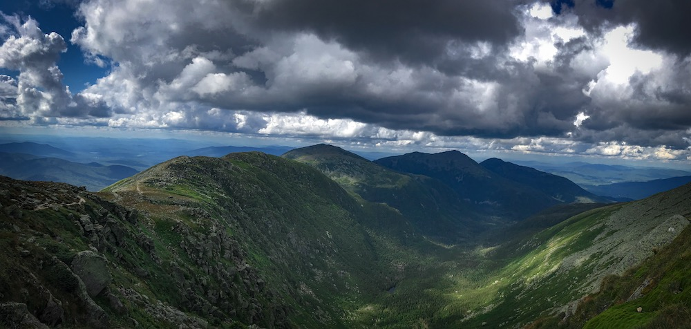
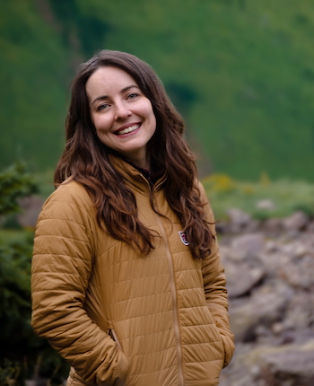

    

        
    

    

        

            Welcome! I'm Saber, a University of Delaware PhD holder (in Climatology), a prior tenure-track Assistant Professor at Oklahoma State University (now Affiliate Faculty), and currently an Associate Scientist with the National Snow and Ice Data Center working on scientific technical writing, data management, scientific workflows, and science communications.
        

         

            Aside from these "professional" things, I also hold a lot of other identities: wife, daughter, dog-mom, photographer, trail runner, rock climber, bird watcher, backpacker, critter lover, teacher, mentor, book and video game lover, Dungeons and Dragons nerd... the list could go on. As I step into a new chapter of both my professional and personal life, I am excited to embrace more facets of what makes me "me," and with time, this website will likely grow to reflect that.
        

    

            Although I have moved on from "traditional" academia, I still love a good <a href="https://saberbrasher.github.io/publications/">research project</a> and am leading/have worked with some <a href="https://saberbrasher.github.io/people/">amazing students</a>.
    

            The website is currently a work in progress, but feel free to look around to get a sample of my interests listed above. If you are interested in learning more about me, and why I chose to transition my career, I have written a bit about it <a href="https://saberbrasher.github.io/change/">here</a>.
     

   
  
    
