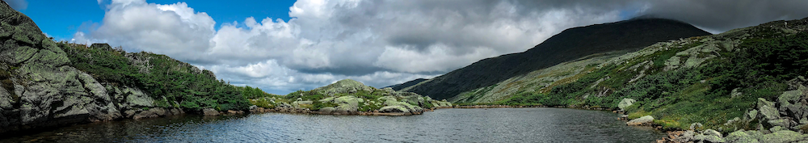

 The HydRA lab studies <b> Hydroclimate and EnviRonmental Adaptation to climate change </b> at Oklahoma State University. Climate change touches all aspects of the natural world, with shifting weather patterns and water regimes changing the environment at a rapid rate. The lab is grounded in the field of Climatology, but frequently delves into adjacent disciplines such as Meteorology, Environmental Science, and Biogeography to study environemntal changes more holistically. </style>

Put your address / P.O. box / other info right below your picture. You can also disable any of these elements by editing `profile` property of the YAML header of your `_pages/about.md`. Edit `_bibliography/papers.bib` and Jekyll will render your [publications page](/al-folio/publications/) automatically. </style>

